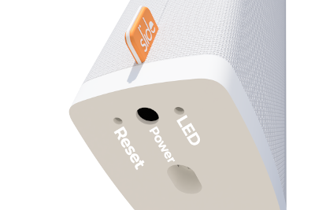

The `slide_local`  allows you to integrate your [slide.store](https://slide.store/) devices in Home Assistant using the local API. Both the integration and this documentation is inspired by the custom component by @ualex73, who also wrote the library to access the API.

## Supported devices

The integration should work with all Slide covers (API version 1 and 2).

## Prerequisites

Before you can use the integration, you have to make sure the slide is configured for the local API. By default the Slide connects to the cloud API, but it is possible to use the local API too (only 1 of them can be active). To switch between the cloud and local API, do the following step:

    Press the reset button 2x

LED flashes 5x fast: cloud API disabled, local API enabled
LED flashes 2x slow: local API disabled, cloud API enabled


If a new Slide is installed, it could be the firmware is too old. Configure it via the cloud API and wait a few days (or contact Slide support to push a newer firmware).




To setup the integration you need the following information:


hostname:
  description: Hostname or IP of the slide device.
  required: true
  type: string
password:
  description: The device code of your Slide (inside of your Slide or in the box, 8 characters). Only required for API 1, with API 2 you can fill in anything here.
  required: true
  type: string
invert_position:
  description: Invert position percentage.
  required: true
  default: false
  type: boolean


## Supported functionality

### Covers

Your slide devices will appear as covers.

## Data updates

The integration fetches data from the device every 15 seconds.

## Actions

## Known limitations

The integration only provides connection with Slide devices via the local API. For connecting via the cloud API, please use the `slide` integration.

## Remove integration

This integration can be removed by following these steps:


